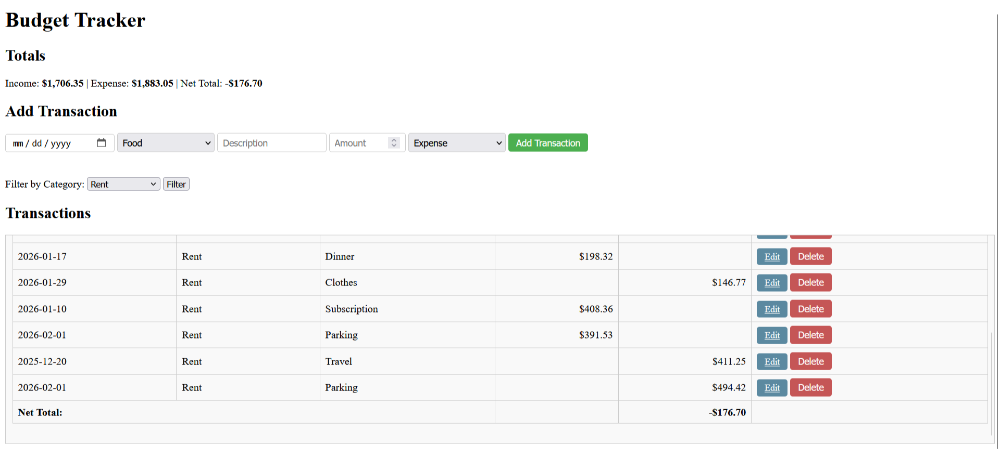

# Budget-Tracker

**Budget-Tracker** is a full-stack web application that helps users gain control of their personal finances by tracking income, expenses, and net balances in a simple, intuitive interface. Built with **Flask** and **SQLAlchemy**.

This project demonstrates backend architecture, database modeling, authentication, and maintainable Flask application design.

## Demo

Deployed on Render: [https://budget-tracker-fko1.onrender.com/](https://budget-tracker-fko1.onrender.com/)



## Features

#### Core Functionality:
- User authentication (register, login, logout)
- Add, edit, and delete financial transactions 
- Categorize transactions (Food, Rent, Transport, etc.)
- Track income vs expenses  
- View calculated totals and net balance 
- Validates user input (dates, amounts, transaction type)

#### Filtering & Organization:
- Filter transactions by category
- Filter by date range
- Sort transactions (date, amount, type)

#### UX Improvements:
- Flash messages for success/error feedback
- Currency formatting 
- Responsive HTML/CSS layout 
- Confirmation dialog for transaction deletion

#### Testing:
- Unit testing for models and services


## Tech Stack
- **Backend:** Python, Flask, SQLAlchemy ORM 
- **Database:** SQLite (development), PostgreSQL (production) 
- **Frontend:** Jinja2 templates, HTML/CSS  
- **Authentication:** Flask-Login, Password hashing with Werkzeug
- **Deployment:** Render


## Application Architecture
### Overview
This project follows a layered Flask architecture that separates concerns into distinct components:
- Routes handle HTTP requests and responses.
- Services contain business logic.
- Models represent database structures.
- Forms handle validation of user input.
- Templates and static files provide the frontend.

### Highlights
- **Application factory pattern** for flexible configuration  
- **Blueprint routing** for modular structure  
- **Service layer** separating business logic from routes  
- **SQLAlchemy ORM** for database modeling  
- **Template filters** for presentation logic

### Project Structure
```
budget-tracker
│
├── run.py        # Development entry point
├── wsgi.py       # Production entry point
├── seed.py       # Database seeding script
│
├── app/
│   ├── __init__.py     # Flask app factory
│   ├── config.py       # Environment configuration
│   ├── extensions.py   # Flask extensions (DB, login manager, etc.)
│   ├── models.py       # SQLAlchemy models
│   ├── forms.py        # Input validation
│   ├── filters.py      # Jinja template filters
│
│   ├── routes/         # HTTP endpoints
│   │   ├── auth.py
│   │   └── transactions.py
│
│   ├── services/       # Business logic layer
│   │   ├── auth_services.py
│   │   └── transaction_services.py
│
│   ├── templates/      # Jinja templates
│   └── static/         # CSS, JS, images
```

## Installation

1. Clone the repository:
   ~~~
   git clone https://github.com/BraxtonChatman/Budget-Tracker.git 
   cd budget-tracker
   ~~~

2. Create and activate a virtual environment:


   **Linux/Mac:** 
   ~~~ 
   python -m venv venv  
   source venv/bin/activate  
   ~~~

   **Windows:**  
   ~~~
   python -m venv venv  
   venv\Scripts\activate  
   ~~~

3. Install dependencies:
   ~~~
   pip install -r requirements.txt
   ~~~

4. Run the application:
   ~~~
   python run.py
   ~~~

5. Open your browser and go to:  
   ~~~
   http://127.0.0.1:5000/
   ~~~

> Note: The app uses a local SQLite database `budget.db`. Initial categories are automatically seeded if none exist.

## Database Setup
Initialize the database and seed example data
   ~~~
   python seed.py --env dev --reset
   ~~~

This will create:
- demo user 
- sample categories  
- example transactions

#### Demo Account
**Username**: demo

**Password**: demo1234


## Usage

- **Add a transaction:** Enter date, category, description, amount, and type (Income or Expense) and click "Add Transaction".  
- **Edit a transaction:** Click "Edit" next to a transaction, update fields, and submit.  
- **Delete a transaction:** Click "Delete" and confirm.  
- **Filter transactions:** Use the category dropdown to view specific categories.  
- **View totals:** Income, expenses, and net balance are displayed at the top.

## Testing (Planned)

Future improvements include:

- Integration tests for transaction flows  
- Test database configuration


## Future Improvements
- Monthly spending summaries  
- CSV export of transactions  
- Spending analytics with charts  
- REST API for transactions  
- Database migrations with Flask-Migrate  
- Improved UI with layout templates


## Learning Goals

This project was built to strengthen:

- Flask backend architecture  
- Database modeling with SQLAlchemy  
- Authentication and session management  
- Separation of concerns in web applications  
- Production deployment workflows
